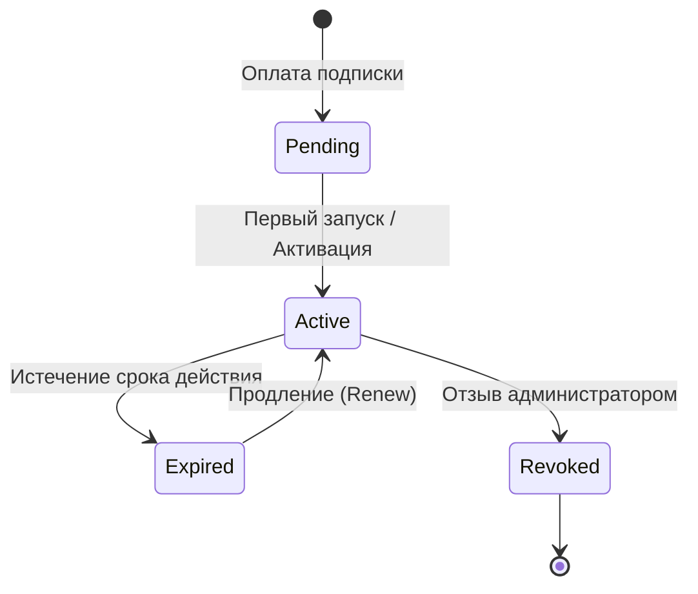

# 🔐 CRM Restaurant Licensing System Architecture & Guide

Архитектурное руководство по принципам генерации, криптографической защиты, валидации и жизненного цикла лицензий в ресторанной CRM.

---

## 1. Формат и генерация ключей

Лицензионный ключ генерируется в безопасном формате из 16 байтов энтропии, разделённых на 4 блока по 4 символа:

```
XXXX-XXXX-XXXX-XXXX
Пример: A1B2-C3D4-E5F6-G7H8
```

- **Кодирование**: Base32 / Alphanumeric (A-Z, 0-9) без неоднозначных символов.
- **Уникальность**: Гарантируется индексом `idx_licenses_key` в БД.
- **Хранение в БД**: Ключ связывается с таблицей `subscriptions` и `clients`.

---

## 2. Жизненный цикл лицензии (Lifecycle)



### Статусы:
- `pending`: Ключ создан, но ещё не активирован ни на одном устройстве.
- `active`: Действующая лицензия, проверки проходят успешно.
- `expired`: Срок подписки истёк. POS-терминал переходит в режим только для чтения или блокируется.
- `revoked`: Лицензия отозвана службой безопасности (нарушение условий, возврат средств).

---

## 3. Привязка к оборудованию (Device Fingerprinting)

Для предотвращения пиратского тиражирования лицензии привязываются к уникальному отпечатку POS-терминала:
- **MAC-адрес** сетевых интерфейсов;
- **Имя хоста** (hostname) и ОС;
- **Архитектура процессора** и системные идентификаторы.

Каждый ключ имеет ограничение `max_activations` (по умолчанию 5 терминалов на ресторан). При превышении лимита сервер отклоняет запрос:
```json
{ "error": "Maximum activations reached (5/5)" }
```

---

## 4. Локальное шифрование на клиенте (AES-256)

Утилита командной строки и модуль POS-терминала сохраняют лицензионные данные в зашифрованном виде:
- Алгоритм: **AES-256-CBC** с уникальным вектором инициализации (IV).
- Конфигурационный файл: `~/.crm-license/config.json`.
- Никакие сырые токены или ключи не сохраняются в открытом виде.
